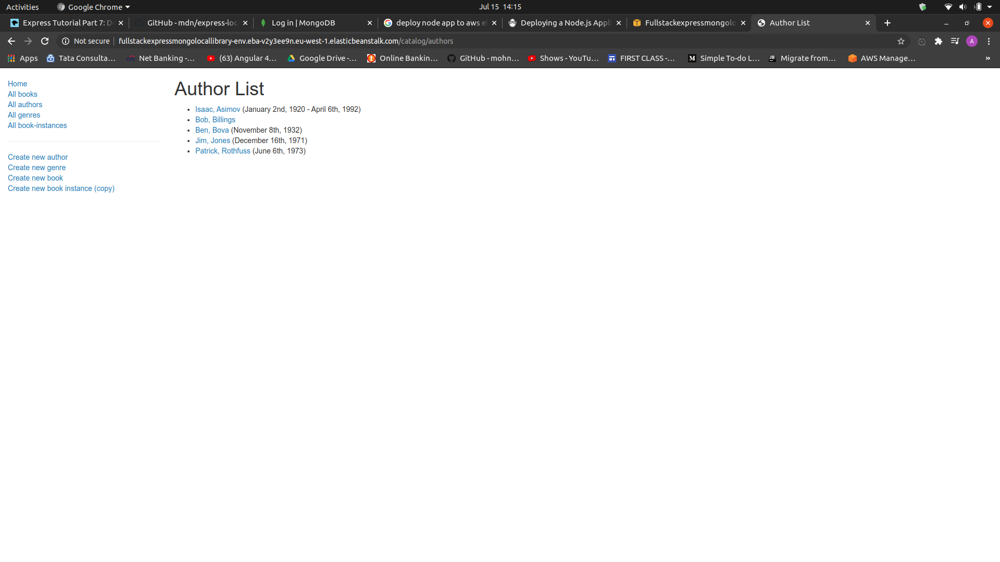

# express-locallibrary-tutorial
Tutorial "Local Library" website written in in Node/Express.
----
This web application creates an online catalog for a small local library, where users can browse available books and manage their accounts.

It uses Express for routing and MongoDB as backend

GUI/Forms are rendered using pug view template

This application is deployed in AWS Beanstalk.

Below is the screenshot of the running application 

